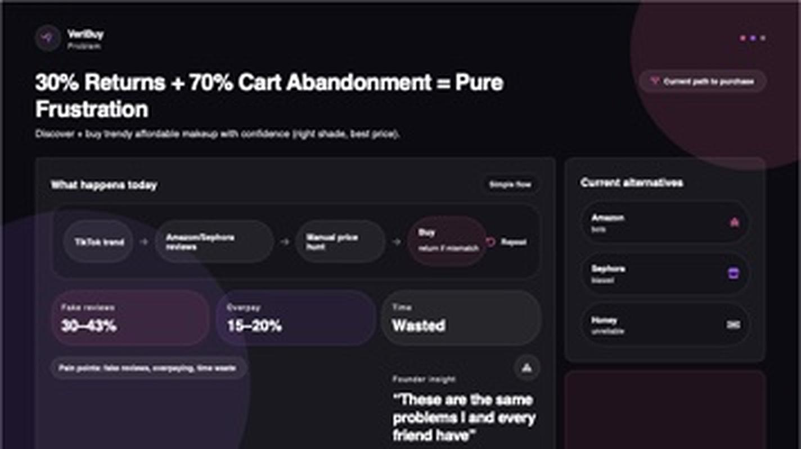
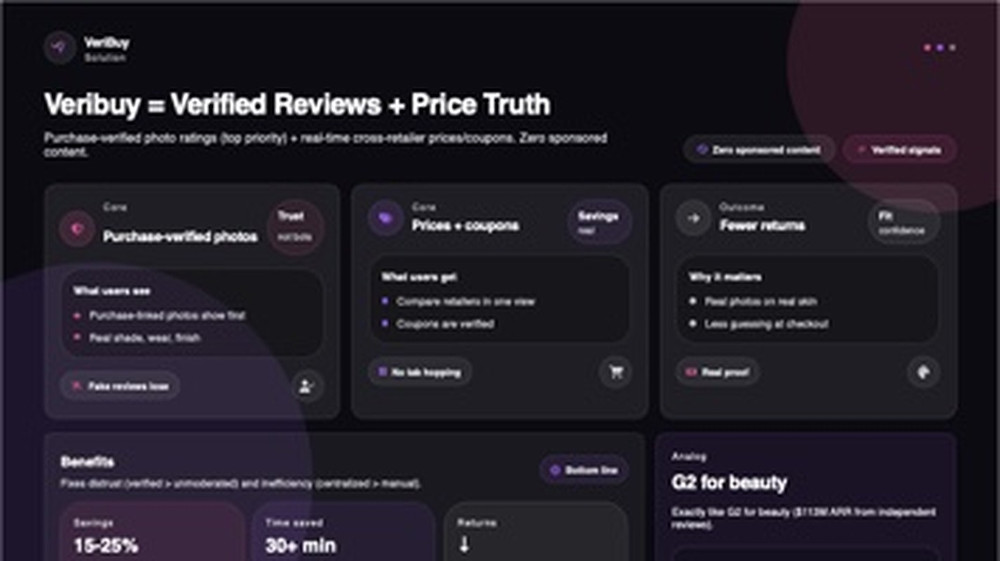
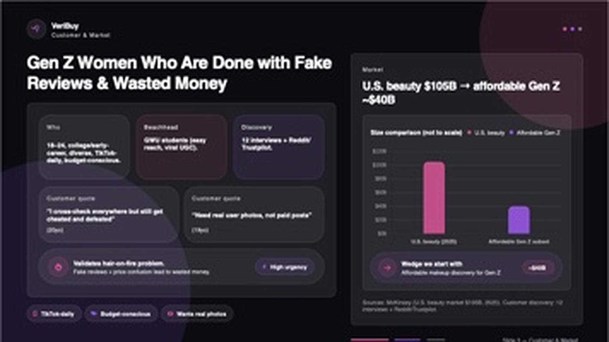
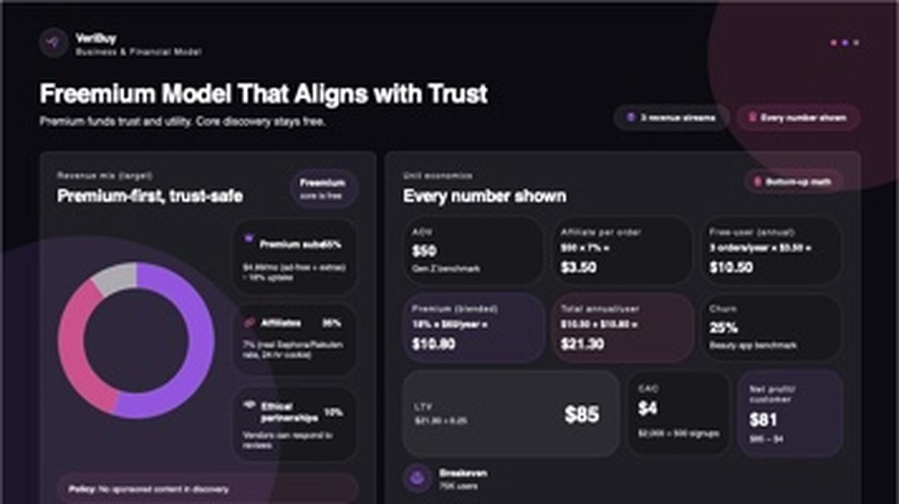

<div align="center">

# VeriBuy
### Real Reviews, Real Prices, No Fake Hype.

**AI-powered beauty discovery with purchase-verified photo ratings and real-time cross-retailer prices + auto-verified coupons — so Gen Z buys trendy, affordable makeup with confidence.**

🏆 **GW New Venture Competition Semifinalist**

[Live MVP](https://veribuy.vercel.app) · Built by Yusra Faheem, GWU CS '28

</div>


---

## The Problem

### 30% Returns + 70% Cart Abandonment = Pure Frustration

Discovering and buying trendy, affordable makeup with confidence — the right shade, at the best price — is broken.

| | |
|---|---|
| **30–43%** | of beauty reviews are fake |
| **15–20%** | average overpay vs. best available price |
| **30%** | return rate |
| **70%** | cart abandonment |

> "These are the same problems I and every friend have." — Founder insight

Today the customer is stuck in a **"trend → trust → price → regret" loop**: a TikTok trend drives a purchase, reviews on the retailer's own site can't be trusted (paid hype, polished signals), the price has to be manually hunted across tabs and coupon sites, and the product often gets returned because of a shade or fit mismatch — only for the loop to repeat with the next trend.



Existing tools don't fix this: Amazon and Sephora reviews aren't independently verified, and coupon extensions like Honey are unreliable.

---

## The Solution

### VeriBuy = Verified Reviews + Price Truth

Purchase-verified photo ratings (our top priority), plus real-time cross-retailer prices and coupons. Zero sponsored content.

| Core | What it does | Why it matters |
|---|---|---|
| **Purchase-verified photos** — *Trust* | Purchase-linked photos are shown first, so shoppers see real shade, wear, and finish | Fake reviews lose |
| **Prices + coupons** — *Savings* | Compare retailers in one view; coupons are verified by real reports, not scraped and stale | No tab hopping |
| **Fewer returns** — *Outcome* | Real photos on real skin mean less guessing at checkout | Real proof, more fit confidence |



**Benefits:** fixes distrust (verified reviews beat unmoderated ones) and inefficiency (one centralized view beats manual tab-hopping) — targeting **15–25% savings**, **30+ minutes saved** per shopping session, and fewer returns.

**Analog:** VeriBuy is *G2 for beauty* — exactly like G2's model in software, where independent reviews built a business with $113M in ARR.

---

## Customer & Market

### Gen Z Women Who Are Done with Fake Reviews & Wasted Money

**Who:** ages 18–24, college and early-career, diverse, TikTok-daily, budget-conscious.

**Beachhead:** GWU students — easy to reach, high potential for viral user-generated content.

**Discovery:** validated through 12 customer interviews plus research across Reddit and Trustpilot.

> "I cross-check everywhere but still get cheated and deflated."

> "Need real user photos, not paid posts."

This validates a hair-on-fire problem — fake reviews and price confusion lead to real wasted money, and urgency is high.



**Market size:** the U.S. beauty market is **$105B** (McKinsey, 2025). The affordable segment that skews Gen Z is roughly **$40B** — and that's the wedge VeriBuy starts with: *affordable makeup discovery for Gen Z, a ~$40B market.*

---

## Business & Financial Model

### Freemium Model That Aligns with Trust

Premium funds trust and utility. Core discovery stays free.

**Revenue mix (target) — premium-first, trust-safe:**

- **Premium subscriptions — 65%**: $4.99/mo for an ad-free experience + extras, targeting ~10% uptake
- **Affiliates — 25%**: ~7% real Sephora/Rakuten-style affiliate rate, 24-hour cookie window
- **Ethical partnerships — 10%**: vendors can respond to reviews — *no sponsored content in discovery, ever*



**Unit economics — every number shown, bottom-up:**

| Metric | Math | Value |
|---|---|---|
| AOV | Gen Z benchmark | $50 |
| Affiliate per order | $50 × 7% | $3.50 |
| Free-user revenue (annual) | 3 orders/yr × $3.50 | $10.50 |
| Premium revenue (blended) | 18% × $60/yr | $10.80 |
| Total annual revenue / user | $10.50 + $10.80 | $21.30 |
| Churn | beauty-app benchmark | 25% |
| **LTV** | $21.30 ÷ 0.25 | **$85** |
| **CAC** | $2,000 ÷ 500 signups | **$4** |
| **Net profit / customer** | $85 − $4 | **$81** |
| Breakeven | | 750 users |

---

## Founder

**MVP live:** [veribuy.vercel.app](https://veribuy.vercel.app)

**Yusra Faheem** — Founder & CEO. Leads product strategy, platform development, and the company's financial and growth strategy — lives the problem daily. GWU CS '28 · Accounting minor.

---

## The Ask

### Big Market. Real Problem. Proven Model. Let's Restore Trust in Beauty.

Ethical shopping in a $40B+ affordable segment, with viral Gen Z growth.

- **Restore trust** — verified reviews, not hype
- **Save money** — real prices, real coupons
- **Buy confidently** — fewer regrets and returns
- **Ethical discovery** — unbiased and affordable


**What we need next — four concrete asks:**

1. **Beta** — GWU first (target: 5 cohorts, 10,000 users)
2. **Partners** — mentorship (target: 10 integrations, 3 sponsors)
3. **Pre-seed funding** — $50K–$150K to polish the MVP, launch at GWU, and hit 10K users
4. **Mentorship & partnerships**

**Contact:** [veribuy.team@gmail.com](mailto:veribuy.team@gmail.com)

---

## Product status

VeriBuy is a live, full-stack web app (Vercel + Supabase) — a **GW New Venture Competition Semifinalist**. The current build includes:

- **Live multi-retailer search & pricing** — real-time Google Shopping results via SerpAPI, with a best-value score, retailer trust signals, filtering, sorting, wishlist, and side-by-side compare
- **Supabase-backed authentication** — email/password sign-up, sign-in, and update-alert preferences
- **Purchase-verified photo reviews** — a required product photo + purchase attestation, star ratings, and a "Photo-verified" badge, backed by Supabase Storage and Postgres with row-level security
- **Crowd-verified coupons** — anyone can submit a code; the community reports whether it worked or not, and each code is labeled **Verified**, **Reported not working**, or **Unverified** based on a rolling 30-day report history, with the discount applied live in search results and the compare table

### Tech stack

- Vanilla JS single-page app (`app.js`, `index.html`) deployed on Vercel
- Vercel serverless functions for live product search (`api/search.js`) and client config (`api/config.js`)
- Supabase for auth, Postgres (reviews, coupons, coupon reports), and Storage (review photos)

### Running locally

```bash
git clone https://github.com/yusrafaheem/veribuy.git
cd veribuy
vercel dev
```

Requires `SUPABASE_URL`, `SUPABASE_ANON_KEY`, and a SerpAPI key configured as environment variables.

---

<div align="center">

*Investor pitch deck content and visuals used above are VeriBuy's own.*

</div>
